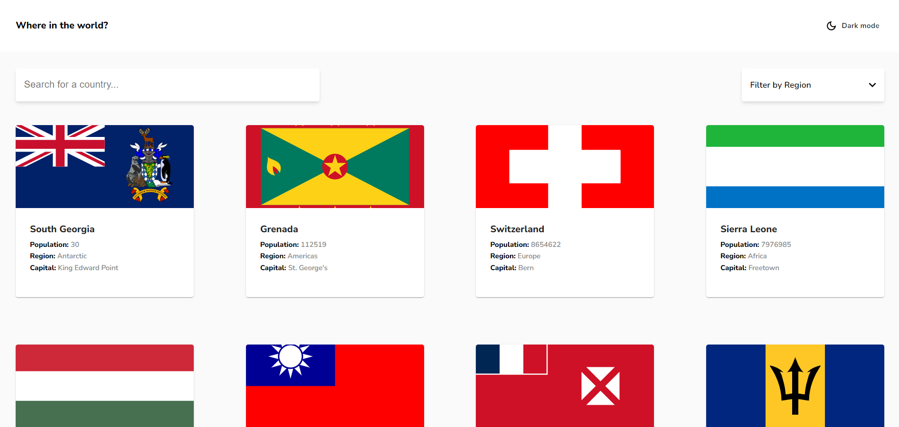
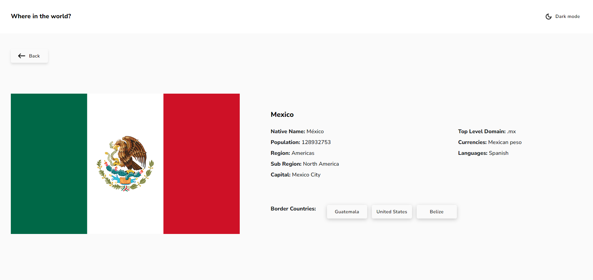
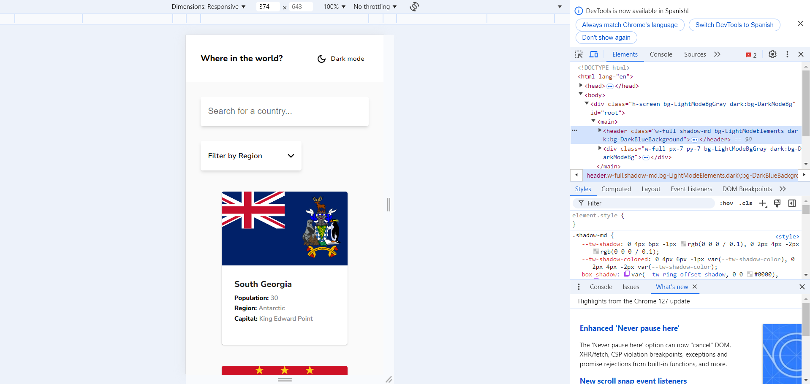
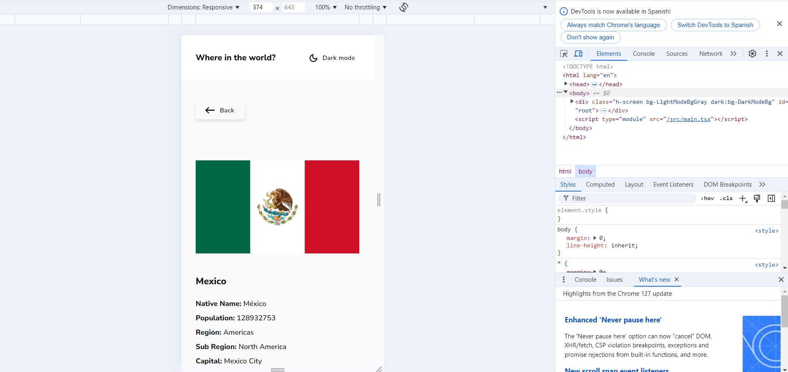
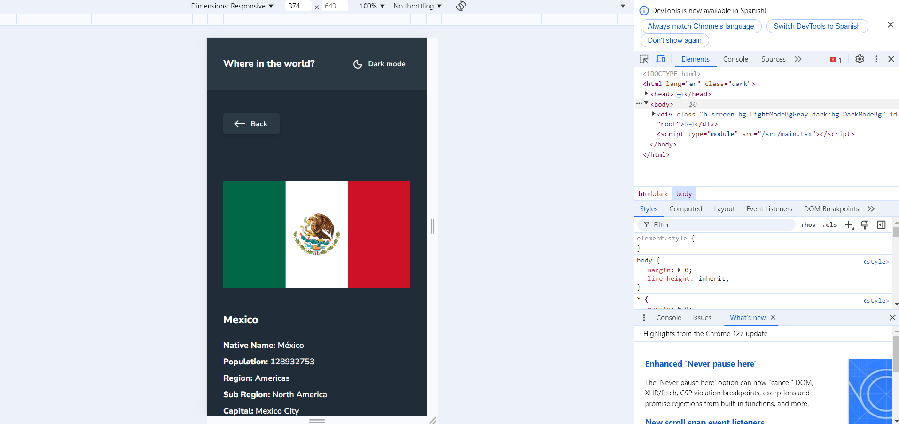

# Frontend Mentor - REST Countries API with color theme switcher solution

This is a solution to the [REST Countries API with color theme switcher challenge on Frontend Mentor](https://www.frontendmentor.io/challenges/rest-countries-api-with-color-theme-switcher-5cacc469fec04111f7b848ca). Frontend Mentor challenges help you improve your coding skills by building realistic projects. 

## Table of contents

- [Overview](#overview)
  - [The challenge](#the-challenge)
  - [Screenshot](#screenshot)
  - [Links](#links)
- [My process](#my-process)
  - [Built with](#built-with)
  - [What I learned](#what-i-learned)
  - [Continued development](#continued-development)
  - [Useful resources](#useful-resources)
- [Author](#author)
- [Requirements](#requirements)
- [Install](#install)
- [Deployment](#deployment)


## Overview

### The challenge

Users should be able to:

- See all countries from the API on the homepage
- Search for a country using an `input` field
- Filter countries by region
- Click on a country to see more detailed information on a separate page
- Click through to the border countries on the detail page
- Toggle the color scheme between light and dark mode

### Screenshot

Desktop


Desktop - detail 



Mobile


Mobile - detail


Mobile - detail darkmode


### Links

- Solution URL: [Add solution URL here](https://your-solution-url.com)
- Live Site URL: [Add live site URL here](https://rineliniguezsosa.github.io/)

## My process

### Built with

- Semantic HTML5 markup
- CSS custom properties
- Flexbox
- Mobile-first workflow
- [React](https://reactjs.org/) - JS library


### What I learned
### Notes

component typing

```tsx
sx?:SxProps<Theme>
```
Explanation:

- SxProps: It is a generic type that accepts a theme (Theme) as an argument. This type allows you to specify a set of style rules that can be applied to a component.

- Theme: The Theme type refers to the Material UI theme that defines the general appearance of the application (colors, fonts, spacing, etc.). If you're using a custom theme, you can extend the default Material UI theme to include your own styles.

MenuProps is a property that can be passed to a Select component

```tsx
 MenuProps?: Partial<MenuProps>,
```

- MenuProps: is a property that can be passed to a component (such as an MUI Select) to customize the behavior and appearance of the drop-down menu that is displayed when the user interacts with the component.

- Partial<MenuProps> indicates that if you decide to pass MenuProps, you can specify only some of the properties of the MenuProps type.

### Continued development

- full stack technologies

### Useful resources

- [Material UI](https://mui.com/material-ui/all-components/) -This resource helped me for the components of the appcountries
- [Tailwindcss](https://tailwindcss.com/) - This resource helped me for the css of the components, drakmode and for the general style


## Author

- Frontend Mentor - [@rineliniguezsosa](https://www.frontendmentor.io/profile/rineliniguezsosa)


## Requirements 

- [Visual Studio Code](https://code.visualstudio.com/) (or any other code editor of your choice)
- [Node.js](https://nodejs.org/)
- npm (version 6 or higher) - This comes with Node.js, but make sure you have the latest version by running `npm install -g npm`.

## Install

Follow these steps to download and run the project locally

1. **Clone this repository:**

  Open your terminal and run the following command:

   ```bash
   git clone https://github.com/rineliniguezsosa/appcountries.git
   ```

2.- **Navigate to the project directory:**

```bash
cd appcountries
```

3.-**Open the project in Visual Studio Code:**

```bash
code .
```

4.-**Install the dependencies:**

```bash
npm install
````

## Deployment

Running the Development Server

To start the development server and see the application in action, run:

```bash
npm run dev
```